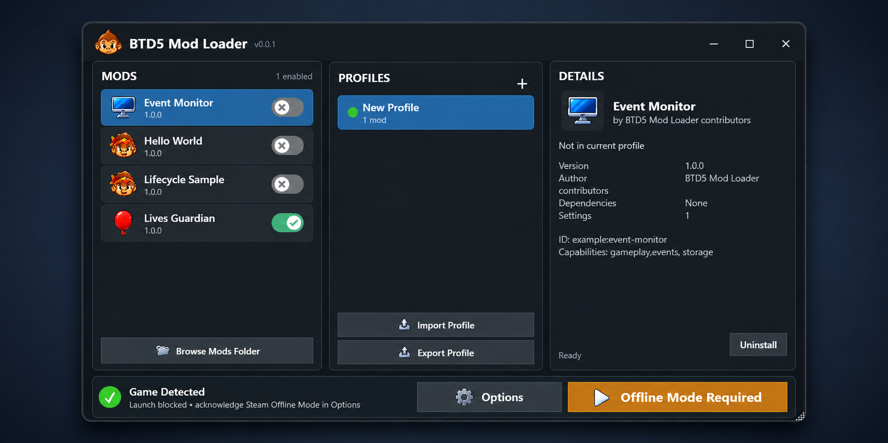

# Manager workflow and recovery

The Windows manager is the player-facing control center for loader installation,
local mod packages, profiles, configuration, diagnostics, and launching. Its
three-pane workflow replaces the original tab-based prototype while preserving
existing profiles, packages, installation records, configuration, and launch
history.

## First-time setup

1. Extract a complete release and run `BTD5ModLoader.Manager.exe` from that
   directory. Do not move only the executable; the native loader and symbol map
   shipped beside it are required.
2. Confirm **Game Detected** in the bottom bar. If discovery did not find the
   correct Steam copy, open **Options**, choose the Bloons TD 5 installation,
   and select **Check loader**.
3. In **Options**, use the context-aware loader button. It reads **Install
   loader** on a clean supported copy and **Repair loader** when a manager-owned
   file is missing.
4. Create a profile with the **+** button in **Profiles**.
5. Drag one `.btd5mod` archive onto the **Mods** pane. Dropping a package
   validates and installs it immediately. Files copied into the folder
   opened by **Browse Mods Folder** are discovered when the manager regains
   focus.
6. Use a mod's switch to add and enable that package version in the current
   profile. Select the mod to configure it or inspect dependency and readiness
   information in **Details**.
7. Put Steam in Offline Mode, open **Options**, and acknowledge the offline-mode
   launch requirement. The green launch button becomes available after the
   loader and current profile pass every readiness check.

The acknowledgement is a required safety prompt, not network enforcement.
Technical network blocking and save isolation remain Phase 9 work. Use modded
profiles only for offline, noncompetitive play.

## What each area controls

### Mods

The left pane is the installed package library. Each row is one installed
package version and its switch represents that exact version in the current
profile:

- an off switch with no profile entry adds and enables that version;
- an off switch for a disabled entry enables it;
- selecting another installed version switches the profile to that version if
  dependency validation succeeds; and
- an on switch disables the current entry if doing so does not break another
  enabled mod.

Installing a package never silently edits a profile. **Remove from profile**
keeps the archive installed, while **Uninstall** removes the archive and is
blocked while any profile still references it. Right-click a package to
configure it, change profile order, or remove it from the profile.

### Profiles

The center pane shows the explicitly selected current profile. The selection is
saved between manager sessions. The **+** button creates a profile; the
right-click menu renames, duplicates, or deletes one. Import and export transfer
the profile definition, including mod order and configuration, but not package
archives.

Deleting the current profile clears the selection. If a saved profile vanishes,
the manager does not guess and select an unrelated profile.

### Details

The right pane separates package facts from profile state. It shows the
installed and selected versions, author, dependencies, number of settings, mod
ID, requested capabilities, and whether the package is enabled in the current
profile. Contextual actions appear only when they apply.

Configuration is stored per profile. The editor derives controls from the
package's `configuration_defaults`: booleans use checkboxes, strings use text
fields, and finite JSON numbers use invariant numeric fields. Values are
validated by the core service before they are saved. Individual settings or the
whole mod can be reset to package defaults.

## Loader health and recovery

The manager fingerprints the selected game before touching it and tracks every
file it owns. The primary Options action follows the current health state:

| State | Meaning | Manager behavior |
| --- | --- | --- |
| `UnsupportedGame` | The directory is not the supported BTD5 build. | Refuse installation and ask for another copy |
| `NotInstalled` | No ownership record or conflicting loader files exist. | Offer **Install loader** |
| `Healthy` | Every recorded loader-owned file matches its hash. | Show ready and allow a recheck |
| `Repairable` | An owned file is missing and its matching release file exists. | Offer **Repair loader** |
| `Conflict` | A foreign target or modified owned file exists. | Preserve it and require manual review |
| `ArtifactUnavailable` | Matching release files are unavailable. | Ask the player to restore the complete release |
| `InvalidRecord` | The ownership record or operation journal is damaged. | Preserve it and explain recovery |

Install and repair preflight all files, journal the operation, verify every copy,
and verify the completed installation. Cancellation or failure rolls back only
files that still match the manager's copies. If the manager terminates during an
operation, the next inspection reconciles the journal. It never overwrites a
foreign or modified file.

Uninstall is deliberately kept in the recovery area. It deletes only verified
loader-owned files. A modified owned file remains on disk and in the ownership
record so it cannot later be mistaken for a missing, safely repairable file.

Release builds find loader artifacts beside the manager. Developers may set
`BTD5ML_ARTIFACT_DIRECTORY` to point at a staged artifact directory; this
override is intentionally absent from the player UI.

## Launch readiness

Readiness is inspected at startup and again immediately before launch. A blocked
launch reports one concrete issue and routes the player to its correction:

- game or loader problems open the relevant control in **Options**;
- a missing current profile focuses **Profiles**;
- a missing package focuses **Browse Mods Folder**;
- invalid configuration selects the affected mod and focuses **Configure**; and
- dependency or profile-order errors select the affected mod for review.

The launch button never relies solely on an earlier status check. It revalidates
the game, loader, installed packages, dependencies, configuration, and resolved
load order before writing the runtime handoff.

## Options, logs, and diagnostics

**Options** contains game selection, loader health and recovery, the offline
acknowledgement, vanilla launch, diagnostics export, and the live runtime log.
The log refreshes while Options is open and formats the loader's JSON-lines log
for quick inspection.

Diagnostics include build hashes, loader and profile validation, resolved
package identities, and runtime messages. They redact machine-specific paths and
exclude game files, saves, package contents, and configuration values.

## Existing-state migration

The first revamped-manager startup inventories existing profiles, installation
records, and package archives. Profile and installation schemas remained
compatible, so migration does not rewrite them. Instead it:

1. validates existing profile and installation records;
2. creates byte-for-byte backups under
   `%LocalAppData%\BTD5ModLoader\backups\revamped-manager-v1`;
3. infers a game copy or profile only when exactly one valid choice exists;
4. writes atomic manager settings and a one-time migration marker; and
5. leaves ambiguous selections empty for the player to choose explicitly.

Configuration and launch history remain in the original profile file and are
covered by automated byte-preservation tests. If migration cannot complete, the
manager reports the problem and keeps the original state rather than partially
converting it.

See [manager storage and ownership](manager-storage.md) for the on-disk layout.
